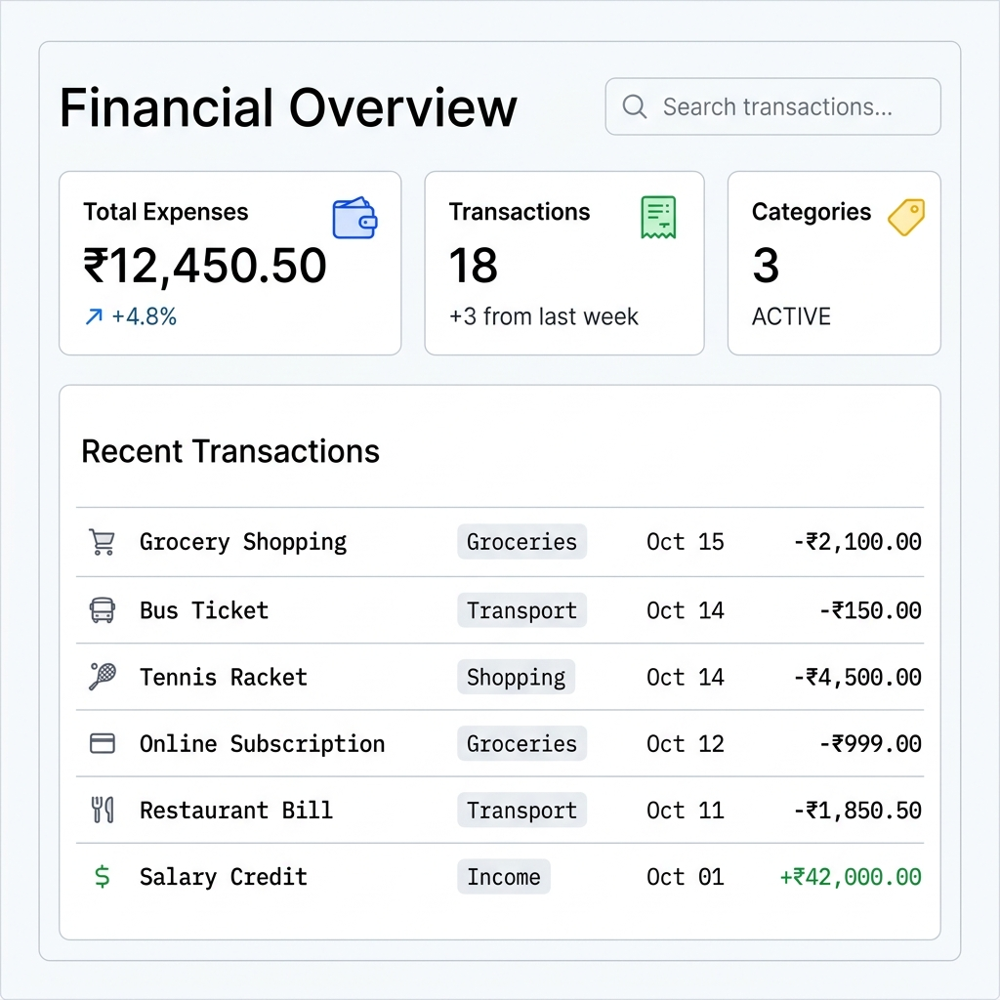
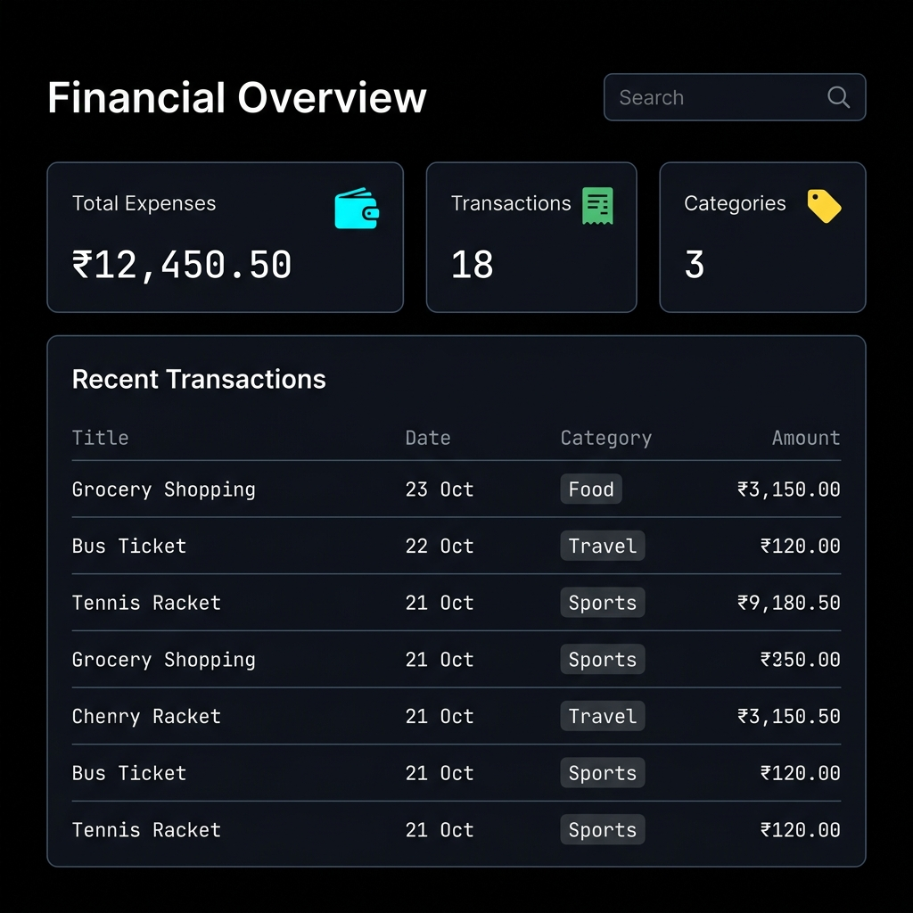

# 💰 ExpenseFlow

**ExpenseFlow** is a minimal, high-contrast, professional expense tracker dashboard designed for developers who appreciate clean design, minimal interfaces, and high-performance workflows. Inspired by the UI systems of Stripe, Notion, and Vercel.

---

## 📸 Interface Screenshots

### Light Mode Dashboard


### Dark Mode Dashboard


---

## ✨ Features

- **Minimalist Vercel-Style Aesthetics**: Pure black backgrounds, sharp borders (`0.375rem`), and flat glow focus indicators.
- **Adaptive High-Contrast Themes**:
  - **Light Mode**: Pure black-on-white text with thin slate grid borders and electric blue highlights.
  - **Dark Mode**: Electric cyan highlights on a pure black background.
- **Dynamic Theme Toggle**: Persists your theme preferences across refreshes using `localStorage`.
- **Premium Font Pairing**:
  - **Space Grotesk**: Heavy bold headlines (`700` weight, `-0.03em` spacing) for titles, metrics, and branding.
  - **IBM Plex Mono**: Minimal monospace font for data points, list items, table text, buttons, and metadata.
- **Financial Analytics**: Total Expense aggregation, transaction count, active category summaries, and visual category spending progress trackers.
- **Search and Filter**: Filter transaction history instantly using the integrated navbar search group.

---

## 🛠️ Tech Stack

- **Backend**: Django 5.x
- **Database**: SQLite (Development)
- **Frontend**: HTML5, Bootstrap 5.3.3, Bootstrap Icons
- **Styles**: Custom CSS Variables, responsive grid layouts
- **Typography**: Space Grotesk & IBM Plex Mono (Google Fonts)

---

## 🚀 Quick Start

1. **Activate Virtual Environment**:
   ```bash
   # For Windows PowerShell
   ..\myenv\Scripts\Activate.ps1
   ```

2. **Run Django Migrations**:
   ```bash
   python manage.py migrate
   ```

3. **Launch Local Server**:
   ```bash
   python manage.py runserver
   ```

4. **Access the Dashboard**:
   Open [http://127.0.0.1:8000/](http://127.0.0.1:8000/) in your web browser.
