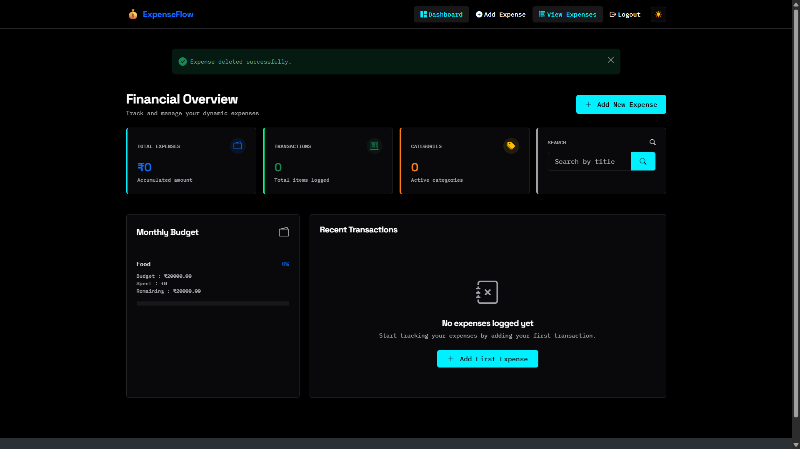

# 💰 ExpenseFlow

ExpenseFlow is a modern full-stack expense management web application built with **Django**. It enables users to securely manage their daily expenses, monitor spending, set monthly budgets, and gain insights through a clean and responsive dashboard.

---

## ✨ Features

### 🔐 Authentication
- User Registration
- Secure Login & Logout

### 💳 Expense Management
- Add Expenses
- Edit Expenses
- Delete Expenses
- View All Expenses
- Search Expenses by Title

### 📊 Dashboard
- Total Expenses
- Total Transactions
- Active Categories
- Category-wise Expense Summary

### 💰 Budget Management
- Set Monthly Budget by Category
- Track Amount Spent
- Remaining Budget Calculation
- Progress Bar with Budget Usage
- Visual Budget Monitoring

### 👤 User Features
- User-specific Expense Management
- Responsive & Modern UI

---

## 🛠️ Tech Stack

### Backend
- Python
- Django

### Frontend
- HTML5
- CSS3
- Bootstrap 5
- Django Template Language (DTL)

### Database
- SQLite3

---

# 📸 Screenshots

## 🏠 Home Page


---

## 🔑 Login Page


---

## 📊 Dashboard



---

## ➕ Add Expense


---

## 💰 Monthly Budget

> Add a screenshot after creating one.

```md

```

---

## 🚀 Getting Started

### 1. Clone the Repository

```bash
git clone https://github.com/adityachillarge005/ExpenseFlow.git
```

### 2. Navigate into the Project

```bash
cd ExpenseFlow
```

### 3. Create a Virtual Environment

**Windows**

```bash
python -m venv venv
venv\Scripts\activate
```

**Linux / macOS**

```bash
python3 -m venv venv
source venv/bin/activate
```

### 4. Install Dependencies

```bash
pip install -r requirements.txt
```

### 5. Apply Migrations

```bash
python manage.py migrate
```

### 6. Create a Superuser (Optional)

```bash
python manage.py createsuperuser
```

### 7. Run the Development Server

```bash
python manage.py runserver
```

Visit:

```
http://127.0.0.1:8000/
```

---

## 📁 Project Structure

```
ExpenseFlow/
│── expense/
│── expense_tracker/
│── ml/
│── trained_models/
│── static/
│── templates/
│── media/
│── manage.py
│── db.sqlite3
│── requirements.txt
│── README.md
```

---

## 🚀 Future Enhancements

- 🤖 AI-powered Expense Insights
- 📊 Interactive Charts & Graphs
- 📈 Monthly & Yearly Reports
- 📤 Export to CSV/PDF
- 🌙 Dark Mode
- 🔔 Email Budget Alerts
- 📱 Django REST Framework API
- 📲 Mobile Application

---

## 🤝 Contributing

Contributions are welcome!

1. Fork the repository.
2. Create a feature branch.
3. Commit your changes.
4. Push the branch.
5. Open a Pull Request.

---

## 📄 License

This project is licensed under the MIT License.

---

## 👨‍💻 Author

**Aditya**

⭐ If you found this project useful, consider giving it a star on GitHub!
